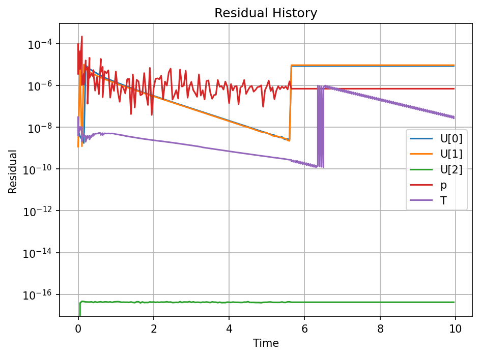
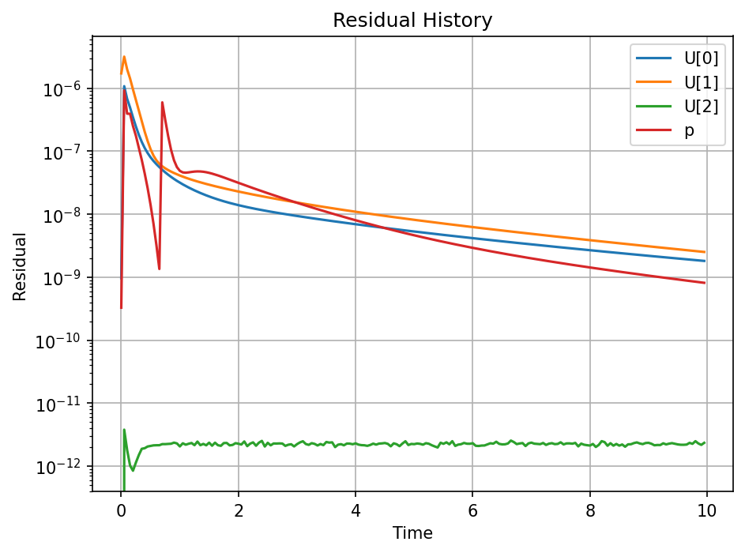
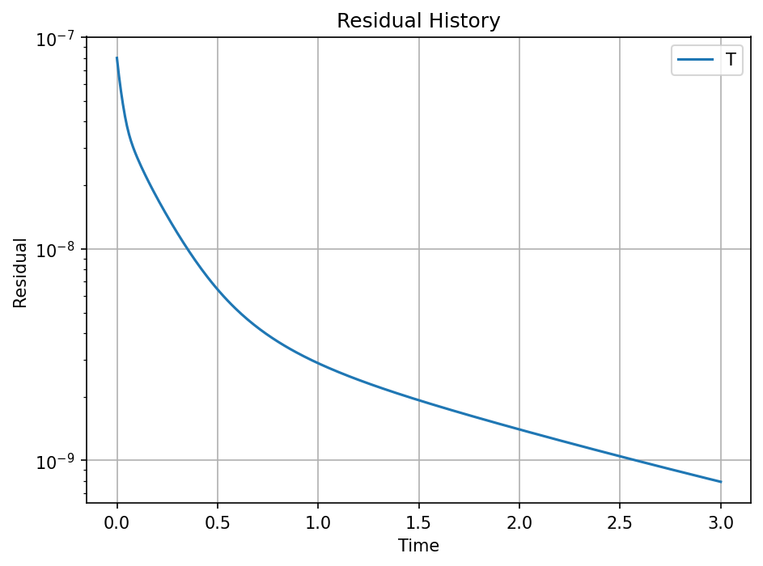

<p align="center">
  
</p>

<p align="center">
  <a href="https://github.com/sherlockyzd/pyOpenFOAM/blob/main/LICENSE"></a>
  <a href="https://www.python.org/downloads/"></a>
  <a href="https://numpy.org/"></a>
  <a href="https://github.com/google/jax"></a>
  <a href="https://scipy.org/"></a>
  <a href="https://matplotlib.org/"></a>
  <a href="https://github.com/sherlockyzd/pyOpenFOAM/stargazers"></a>
</p>

<p align="center">
  <b>中文</b> | <a href="#english-version">English</a>
</p>

---

> **基于有限体积方法（FVM）的 Python 计算流体动力学求解器**，兼容 OpenFOAM 网格格式，支持 NumPy / JAX 双后端架构。

<details>
<summary><b>📑 目录</b></summary>

- [✨ 特性](#-特性)
- [🚀 快速开始](#-快速开始)
- [📐 支持的物理现象](#-支持的物理现象)
- [🧪 算例展示](#-算例展示)
- [⚡ 后端切换](#-后端切换)
- [📁 项目结构](#-项目结构)
- [📚 参考](#-参考)
</details>

---

## ✨ 特性

<table>
<tr>
<td width="50%">

**网格与边界**
- 结构化 / 非结构化网格
- 多种边界条件（壁面、入口、出口、对称面等）
- OpenFOAM 原生网格格式兼容

</td>
<td width="50%">

**求解与算法**
- SIMPLE / PISO 压力-速度耦合
- AMG、PCG、ILU、SOR 线性求解器
- 稳态 / 瞬态模拟

</td>
</tr>
<tr>
<td width="50%">

**后端架构**
- NumPy 默认后端（生产运行最快）
- JAX 后端（自动微分 / GPU / JIT）
- 一行配置切换

</td>
<td width="50%">

**可视化**
- 模拟结束自动保存残差历史图
- OpenFOAM 算例结构原生支持
- 兼容 ParaView 后处理

</td>
</tr>
</table>

---

## 🚀 快速开始

### 安装

```bash
git clone https://github.com/sherlockyzd/pyOpenFOAM.git
cd pyOpenFOAM

conda create --name pyOF python=3.10 numpy matplotlib scipy
conda activate pyOF
```

### 运行算例

```bash
# 顶盖驱动方腔流（结构化网格）
cd example/cavity && python pyFVMScript.py

# 90° 弯管流动（非结构化网格）
cd example/elbow && python pyFVMScript.py

# 法兰盘热传导（非结构化网格）
cd example/flange && python pyFVMScript.py
```

### 代码调用

```python
from pyFVM.Region import Region

case = Region("/path/to/case")
case.RunCase()
# 模拟结束后，算例目录下自动生成 residualHistory.png
```

---

## 📐 支持的物理现象

| 方程 | 说明 |
|:---:|---|
| 动量方程 | Navier-Stokes |
| 连续性方程 | 质量守恒 |
| 能量方程 | 传热 |
| 压力-速度耦合 | SIMPLE / PISO |

---

## 🧪 算例展示

| 算例 | 类型 | 网格 | 残差收敛 |
|:---:|:---:|:---:|:---:|
| `cavity` | 不可压缩流 | 结构化 |  |
| `elbow` | 不可压缩流 | 非结构化 |  |
| `flange` | 传热 | 非结构化 |  |

<details>
<summary><b>📊 查看残差收敛曲线</b></summary>

**Cavity** — 顶盖驱动方腔流



**Elbow** — 90° 弯管流动



**Flange** — 法兰盘热传导



</details>

---

## ⚡ 后端切换

修改 `src/config.py`：

```python
cfdBackend = 'numpy'   # 默认，生产运行最快
# cfdBackend = 'jax'   # JAX 后端（需 pip install jax jaxlib）
```

| 后端 | 性能 | 适用场景 |
|:---:|:---:|---|
| **NumPy** | cavity ~6s | 日常开发、生产计算 |
| **JAX** | 慢 2-3x（无 JIT） | 自动微分、GPU 并行、JIT 编译 |

JAX 后端为以下能力铺路：
- `jax.jit` — 编译计算图 → GPU 加速
- `jax.grad` — 自动微分 → 反演优化、数据同化
- `jax.vmap` / `jax.pmap` — 向量化与多设备并行

---

## 📁 项目结构

```
pyOpenFOAM/
├── src/
│   ├── cfdtool/                # 工具模块
│   │   ├── backend.py          # 后端抽象 + NumpyBackend（24 API）
│   │   ├── backend_jax.py      # JaxBackend 实现
│   │   ├── config.py           # 后端选择
│   │   ├── Solve.py            # 线性求解器
│   │   └── cfdPlot.py          # 残差绘图
│   └── pyFVM/                  # 核心 FVM
│       ├── Region.py           # 仿真控制器
│       ├── Assemble.py         # 方程组装
│       ├── Polymesh.py         # 网格处理
│       └── ...
├── example/
│   ├── cavity/                 # 方腔流（结构化）
│   ├── elbow/                  # 弯管流（非结构化）
│   └── flange/                 # 传热（非结构化）
├── LICENSE
└── README.md
```

---

## 📚 参考

- Moukalled, F., Mangani, L., & Darwish, M. *The Finite Volume Method in Computational Fluid Dynamics: An Advanced Introduction with OpenFOAM and Matlab*. Springer.
- [OpenFOAM](https://www.openfoam.com/) — 开源 CFD 工具箱

---

<p align="center">
  如果觉得有用，欢迎 <a href="https://github.com/sherlockyzd/pyOpenFOAM"><b>⭐ Star</b></a> 支持一下！
</p>


---

## English Version

<p align="center">
  <b>English</b> | <a href="#pyopenfoam">中文</a>
</p>

> **A Python-based CFD solver implementing the Finite Volume Method (FVM)**, compatible with OpenFOAM mesh formats, supporting NumPy / JAX dual backends.

### ✨ Key Features

- **Multi-dimensional mesh** — Structured and unstructured with various boundary conditions
- **Multiple solvers** — AMG, PCG, ILU, SOR
- **SIMPLE / PISO** — Steady-state and transient simulations
- **Dual-backend** — NumPy (default) and JAX, switch with one line
- **OpenFOAM compatible** — Native mesh format and case structure support
- **Auto visualization** — Residual history plot saved automatically

### 🚀 Quick Start

```bash
git clone https://github.com/sherlockyzd/pyOpenFOAM.git
cd pyOpenFOAM
conda create --name pyOF python=3.10 numpy matplotlib scipy
conda activate pyOF
```

```bash
cd example/cavity && python pyFVMScript.py   # Lid-driven cavity
cd example/elbow  && python pyFVMScript.py   # Pipe elbow
cd example/flange && python pyFVMScript.py   # Heat conduction
```

### ⚡ Backend Switch

```python
# src/config.py
cfdBackend = 'numpy'   # Default
# cfdBackend = 'jax'   # pip install jax jaxlib
```

### 🧪 Example Cases

| Case | Type | Mesh | Notes |
|:---:|:---:|:---:|---|
| `cavity` | Incompressible | Structured | Lid-driven cavity benchmark |
| `elbow` | Incompressible | Unstructured | 90-degree pipe elbow |
| `flange` | Heat transfer | Unstructured | Thermal conduction |

<details>
<summary>📊 Residual Convergence</summary>


</details>

### 📁 Structure

```
pyOpenFOAM/
├── src/cfdtool/     # Backend, solvers, plotting
├── src/pyFVM/       # Core FVM: Region, Assemble, Polymesh
├── example/         # cavity, elbow, flange
├── LICENSE
└── README.md
```

### 📚 References

- Moukalled et al., *The Finite Volume Method in CFD*. Springer.
- [OpenFOAM](https://www.openfoam.com/)

---

<p align="center">
  If you find this useful, give it a <a href="https://github.com/sherlockyzd/pyOpenFOAM"><b>⭐ Star</b></a>!
</p>


